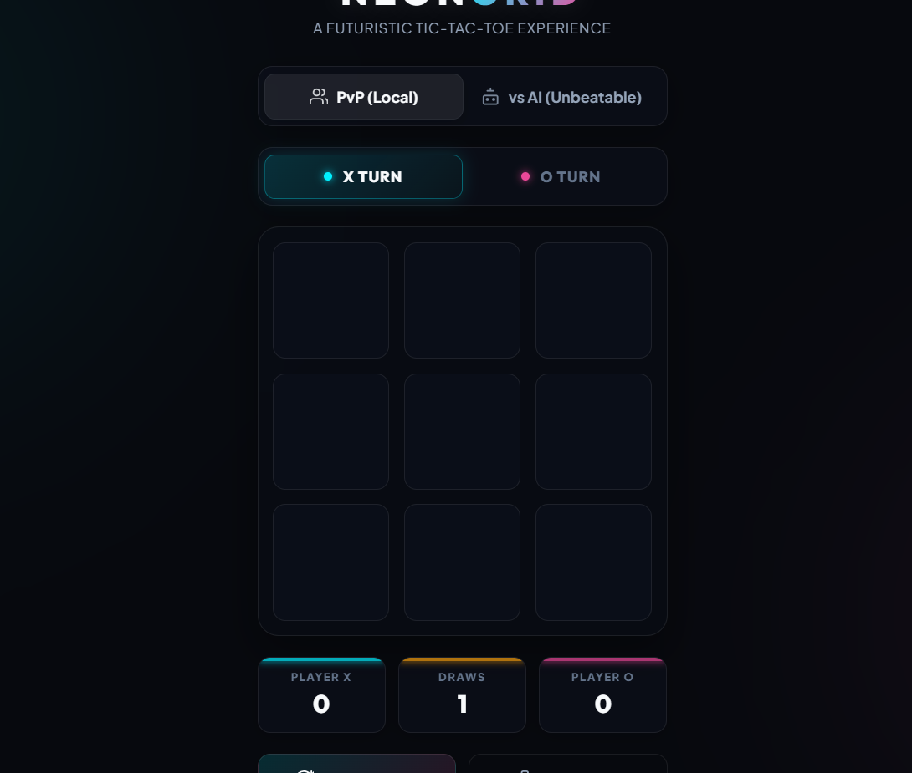
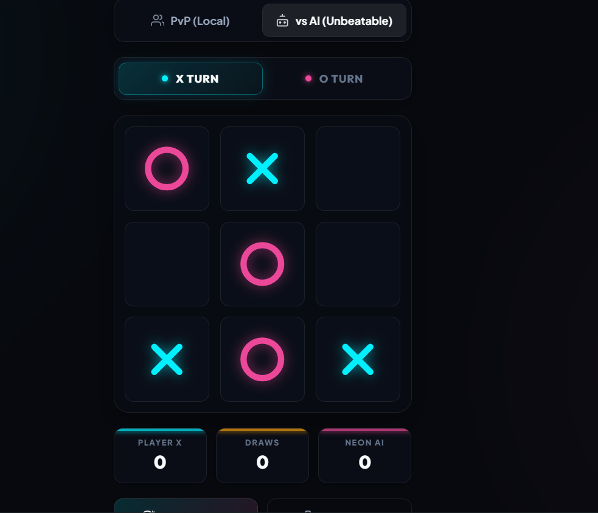

# SCT_WD_3
Tic-Tac-Toe Web Application
# 🎮 Tic-Tac-Toe Web Application

A modern and interactive Tic-Tac-Toe Web Application developed as **Task 3** of the **SkillCraft Technology Web Development Internship**.

## 🚀 Project Overview

This project is a browser-based Tic-Tac-Toe game built using HTML, CSS, and JavaScript. It allows two players to compete on a 3×3 game board, automatically detects winners and draws, and provides a seamless gaming experience through an intuitive and responsive user interface.

## ✨ Features

* Interactive 3×3 Game Board
* Two-Player Gameplay (X vs O)
* Automatic Winner Detection
* Draw/Tie Detection
* Reset Game Functionality
* Responsive Design
* Smooth User Experience
* Modern User Interface

## 🛠️ Technologies Used

* HTML5
* CSS3
* JavaScript (ES6)

## 📂 Project Structure

```text
SCT_WD_3/
│
├── index.html
├── style.css
├── script.js
├── screenshots/
└── README.md
```

## 📸 Project Screenshots

### Home Screen



### Gameplay



### Winner Screen


### Mobile Responsive View


## 🎯 Objectives

The objective of this project is to develop an engaging and interactive web-based game while demonstrating core front-end development concepts such as event handling, game logic implementation, DOM manipulation, and responsive web design.

## 💡 Key Concepts Implemented

* DOM Manipulation
* Event Handling
* Game State Management
* Winner Detection Logic
* Draw Detection Logic
* Responsive Web Design
* User Interface Development

## 🎲 How to Play

1. Player X starts the game.
2. Players take turns placing their marks (X or O) on the board.
3. The first player to align three marks horizontally, vertically, or diagonally wins.
4. If all cells are filled without a winner, the game ends in a draw.
5. Click the Reset button to start a new game.

## 📱 Responsive Design

The application is optimized for:

* Desktop Computers
* Laptops
* Tablets
* Mobile Devices

## 🔮 Future Enhancements

* Single Player Mode (AI Opponent)
* Difficulty Levels
* Scoreboard System
* Sound Effects
* Dark Mode
* Multiplayer Online Support

## 📖 Learning Outcomes

Through this project, I gained hands-on experience in:

* Building interactive web applications
* Implementing game logic using JavaScript
* Managing application state
* Creating responsive layouts
* Enhancing user experience through UI design

## 🙏 Acknowledgement

This project was completed as part of the **SkillCraft Technology Web Development Internship Program**.

⭐ If you found this project useful, feel free to star this repository.
